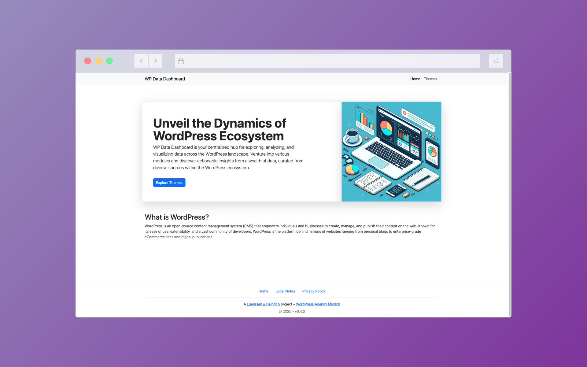
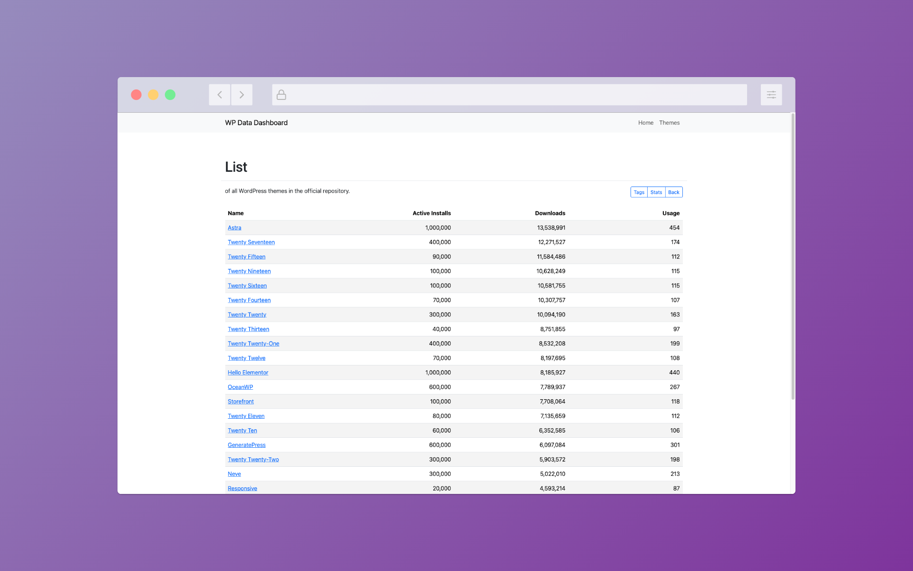
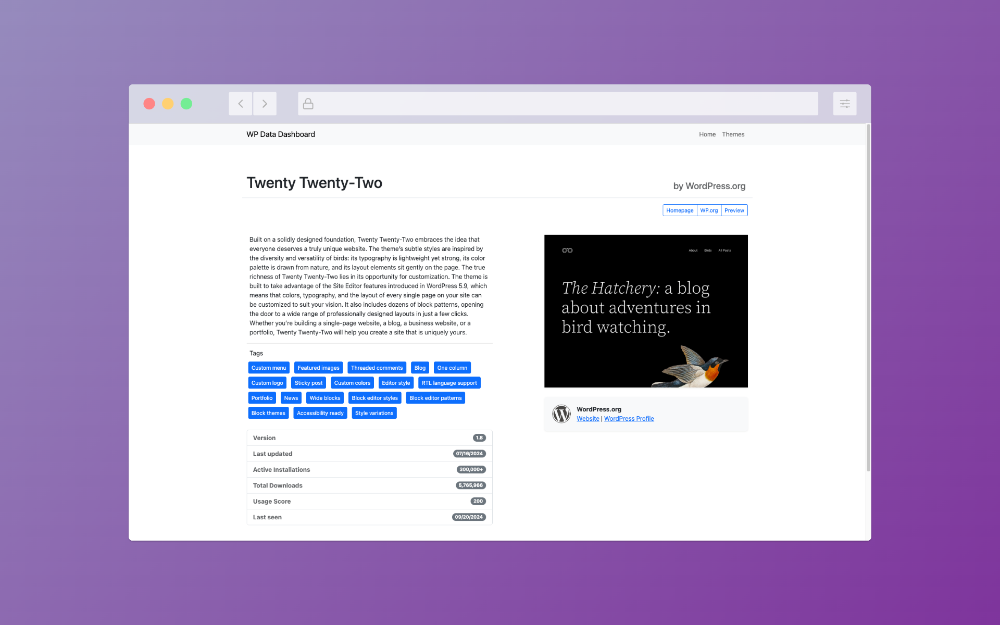

# WP Data Dashboard 📊

This project aims to gather, combine, analyze, and visualize data from different sources within the WordPress ecosystem. The main goal is to provide a dashboard that can be used by anyone to gain a better understanding of the state of the WordPress ecosystem.

## Sunsetting WP Data Dashboard 🌅

### Initial Goals and Intentions 🎯

When we initially created the WP Data Dashboard, our goals included serving as a training opportunity, notably for a non-WordPress tech stack, gaining insight into the usage patterns of the WordPress community, and providing value to the broader WordPress ecosystem. We aimed to closely monitor the adoption of full site editing and the block editor. Although our agency adopted the Block Editor early in 2018, our experiences prompted a cautious approach to Full Site Editing.

### Decision to Sunset the Project 🚨

The data collected over recent years, in combination with insights from Joost de Valk's ["CMS Market Share"](https://joost.blog/cms-market-share/), clearly indicated that the adoption of Full Site Editing, outside initiatives led by Automattic, is practically non-existent. It became evident that the broader WordPress community had largely chosen not to embrace Full Site Editing. This led us to a data-supported decision not to adopt Full Site Editing ourselves or to invest heavily in the required knowledge for deploying reliable, sustainable client projects based on this technology. The wider market appears to share our assessment.

Consequently, along with a strategic shift in our priorities, we have decided to sunset the WP Data Dashboard. Additionally, ongoing developments and controversies within the WordPress community since September 2024 have raised concerns about the reliability and validity of WordPress.org data as an absolute source of truth for usage statistics, further reinforcing our decision.

We thank all our users and sincerely hope the project has provided valuable insights. In line with the open and collaborative spirit of the WordPress community, the source code will remain publicly accessible as a learning resource for others.

---

## Additional Resources 🔖

For further reading about this project and its impact, you can check out this article from WP Tavern: ["WP Data Dashboard Tracks WordPress.org Themes Ecosystem"](https://wptavern.com/wp-data-dashboard-tracks-wordpress-org-themes-ecosystem), which provides additional context and insights about our project.

### Screenshots 📸

|  |  |  |
|------------------------------------------|------------------------------------------|------------------------------------------|

---

## Modules 🛠️

The project gathers data for different modules, with each module responsible for providing data for a specific part of the WordPress ecosystem.

### Theme Repository 🎨

The Theme Repository module gathers data from the WordPress theme repository. It provides data about the themes available in the repository, their authors, and their performance over time. This module can also be used to measure trends in the WordPress theme ecosystem.

### Stats 📈

*Usage Score* represents the effectiveness of a theme based on its active installs and total downloads. A high score indicates a theme that not only has been downloaded frequently but also remains actively installed on many sites. The score undergoes a significant decay if the proportion of active installs to downloads is low, indicating that while the theme might be frequently downloaded, it's not retained by users. This metric provides insight into both the initial appeal of a theme and its lasting utility to users.

*Diversity Score* quantifies the distribution of theme downloads among different authors on a scale from 0% to 100%. A high score indicates that downloads are spread across many authors, suggesting a diverse and competitive marketplace. On the other hand, a low score suggests that a few authors dominate the downloads, indicating less diversity. This metric provides insight into the variety of theme offerings and the balance of power in the theme marketplace.
